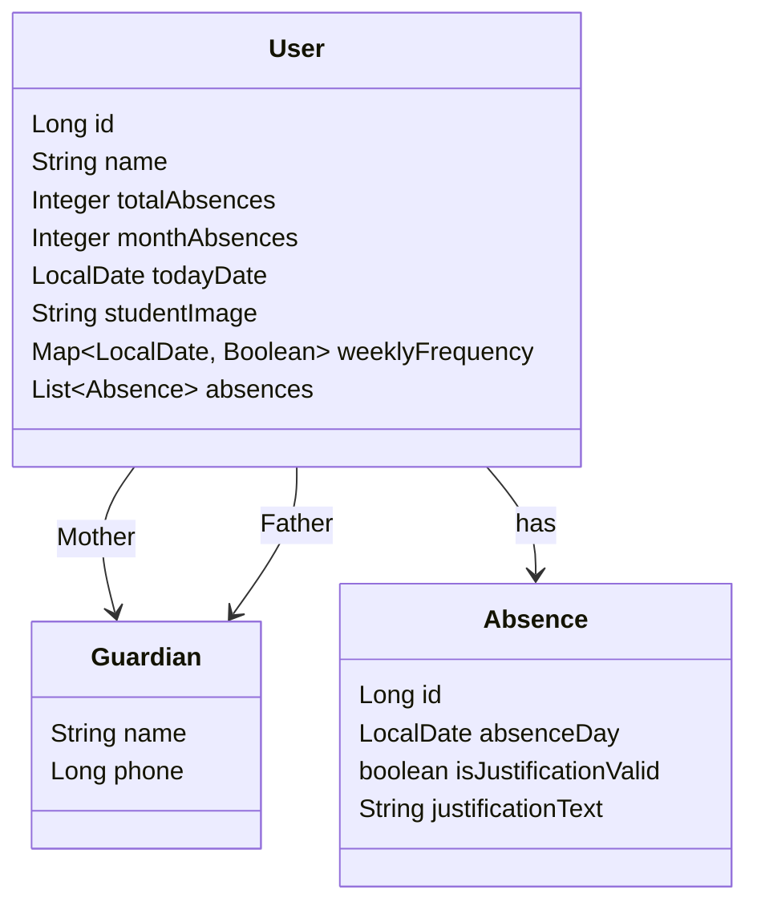
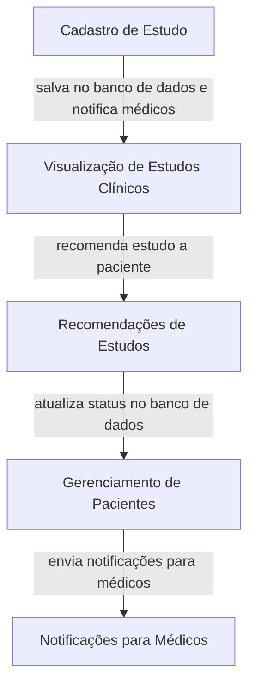

## Diagrama de classes

```mermaid
classDiagram
    class User {
        Long id
        String name
        Integer totalAbsences
        Integer monthAbsences
        LocalDate todayDate
        String studentImage
        Map~LocalDate, Boolean~ weeklyFrequency
        List~Absence~ absences
    }

    class Absence {
        Long id
        LocalDate absenceDay
        boolean isJustificationValid
        String justificationText
    }

    class Guardian {
        String name
        Long phone
    }

    User --> Guardian : Mother
    User --> Guardian : Father
    User --> Absence : has
```
## Fluxograma

```mermaid
graph TD;
    A[Cadastro de Estudo] -->|salva no banco de dados e notifica médicos| B[Visualização de Estudos Clínicos];
    B -->|recomenda estudo a paciente| C[Recomendações de Estudos];
    C -->|atualiza status no banco de dados| D[Gerenciamento de Pacientes];
    D -->|envia notificações para médicos| E[Notificações para Médicos];
```
