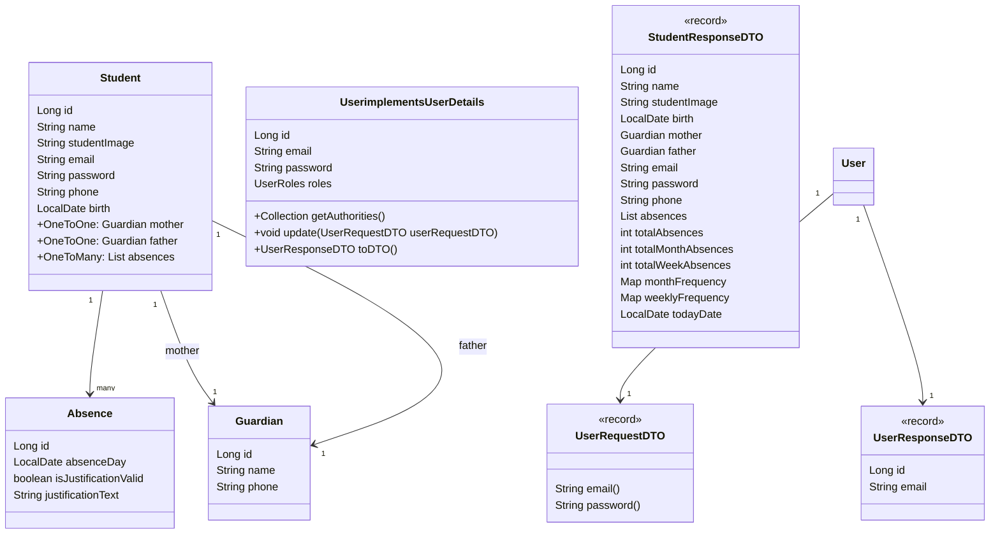

# Attendance System

Este é um sistema de controle de frequência de estudantes, desenvolvido com Spring Boot e PostgreSQL, e está hospedado no Railway. Abaixo, você encontrará as instruções para baixar, iniciar o projeto localmente e visualizar as rotas disponíveis.

## Diagrama de classes


## Pré-requisitos

Certifique-se de ter as seguintes ferramentas instaladas:
- [Java 17+](https://www.oracle.com/java/technologies/javase-jdk17-downloads.html)
- [Maven](https://maven.apache.org/download.cgi)
- [Git](https://git-scm.com/)
- [PostgreSQL](https://www.postgresql.org/download/)

## Como baixar o projeto

Para baixar o projeto, execute os seguintes comandos no terminal:

```bash
# Clone o repositório
git clone https://github.com/andrefilipe1310/attendance-system.git

# Entre na pasta do projeto
cd attendance-system

