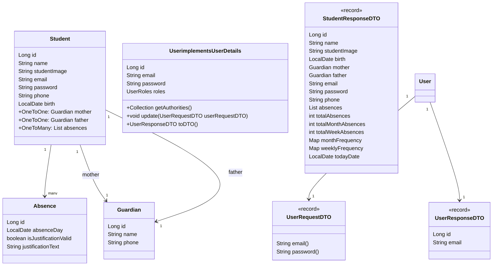

# Attendance System

Este é um sistema de controle de frequência de estudantes, desenvolvido com Spring Boot e PostgreSQL, e está hospedado no Railway. Abaixo, você encontrará as instruções para baixar, iniciar o projeto localmente e visualizar as rotas disponíveis.

## Diagrama de classes


## Pré-requisitos

Certifique-se de ter as seguintes ferramentas instaladas:
- [Java 17+](https://www.oracle.com/java/technologies/javase-jdk17-downloads.html)
- [Maven](https://maven.apache.org/download.cgi)
- [Git](https://git-scm.com/)
- [PostgreSQL](https://www.postgresql.org/download/)

## Como baixar o projeto

Para baixar o projeto, execute os seguintes comandos no terminal:

```bash
# Clone o repositório
git clone https://github.com/andrefilipe1310/attendance-system.git

# Entre na pasta do projeto
cd attendance-system

## Configurações de Banco de Dados

O projeto já está configurado para usar o Railway como banco de dados em produção, mas caso queira rodar localmente, você pode configurar o `application.properties` para apontar para o seu próprio banco PostgreSQL.

### Usando Banco de Dados Local

Edite o arquivo `src/main/resources/application.properties` com as seguintes configurações:

```properties
spring.datasource.url=jdbc:postgresql://localhost:5432/seu_banco
spring.datasource.username=seu_usuario
spring.datasource.password=sua_senha
```
## Usando Railway

O projeto está hospedado no Railway, permitindo que você veja as rotas e funcionalidades em produção sem precisar rodar o projeto localmente.

### Passos para acessar o sistema no Railway:

1. Acesse a aplicação diretamente pela URL: [Attendance System no Railway](https://attendance-system-production.up.railway.app).
2. Utilize uma ferramenta como o [Swagger](http://attendance-system-production.up.railway.app/swagger-ui.html) para explorar as rotas da API e visualizar a documentação interativa.

### Verificando Rotas

Para visualizar as rotas e realizar testes nas APIs, você pode acessar a documentação do Swagger disponível diretamente no ambiente de produção:

- [Swagger - Attendance System](http://attendance-system-production.up.railway.app/swagger-ui.html)

Com essa interface, você pode explorar todas as rotas disponíveis no sistema, fazer requisições e ver as respostas das APIs diretamente pela interface do Swagger.

### Observações

- Certifique-se de que o banco de dados está acessível e a aplicação rodando corretamente no Railway antes de realizar requisições.
- Todas as funcionalidades do sistema estão ativas na versão de produção.
